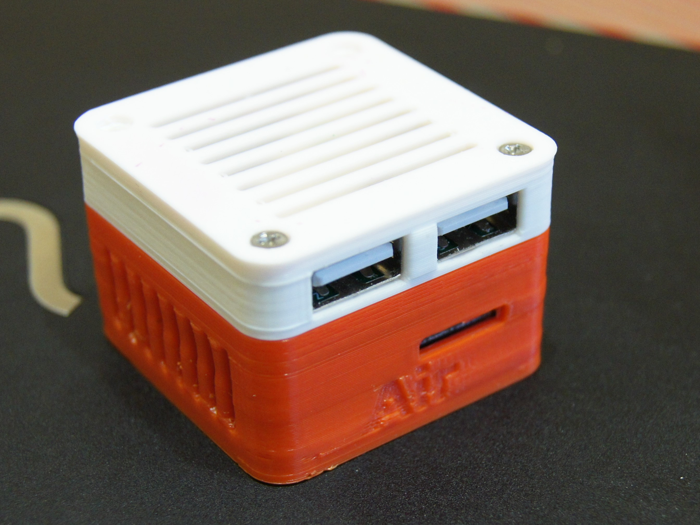

# NanoPI USB hat

## Introduction
NanoPI USB hat is a expansion board which has the same dimension as that of a NanoPi NEO/Air and can be stacked on:
- [NanoPi NEO Air](https://www.friendlyarm.com/index.php?route=product/product&path=69&product_id=151)
- [NanoPi NEO-LTS](https://www.friendlyarm.com/index.php?route=product/product&path=69&product_id=132)
- [NanoPi NEO2](https://www.friendlyarm.com/index.php?route=product/product&path=69&product_id=180)
- [NanoPi NEO Core-LTS](https://www.friendlyarm.com/index.php?route=product/product&path=69&product_id=212)
- [NanoPi NEO Core2](https://www.friendlyarm.com/index.php?route=product/product&path=69&product_id=211)

Contains two USB sockets and PCB 2.4GHz antenna.

DIY version https://www.thingiverse.com/thing:2304339

## Hardware Spec
- 2 USB 
- PCB Antenna
## Buying guide
- USB AF https://l.kool.ru/usb-af 
- 1x12 pinheader https://l.kool.ru/hdrf1r
- 2x12 pinheader https://l.kool.ru/hdrf1r
- IPX ( MHF4 IPEX MHF) pigtail 10 cm https://l.kool.ru/pgtipx
